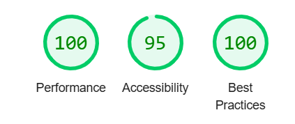

HELP TO PREVENT HATE
The live link can be found here: https://github.com/JOCPhys/PREVENT-Project-JOC

__Overview__
The ‘Help to PREVENT Hate!’ is a website for people to keep our country and communities in the UK safe from those that target vulnerable individuals by spreading hate and negative ideologies and cause fear in our communities. This site is for parents, concerned citizens and professionals working with vulnerable groups who want to keep their communities safe from hate and terrorism. It is for people who want to know more about what the PREVENT strategy is, what to look for and, most importantly, how to report any concerns to the relevant authorities. This site will signpost parents, citizens and professionals to places they can gain information and support, and provide links to where professional training for both individuals and professional teams can be accessed. 

__User Stories__
Users were identified as: anyone who was concerned about unusual behaviour in others such as families or teachers or neighbours concerned that someone was showing signs of being radicalised or supporting negative ideologies or showing signs of risky behaviour; citizens who were concerned about the safety of attending events and wanting to help prevent extremism from taking hold, and leaders of educational establishments who have a legal obligation to annually update their staff on the PREVENT Strategy. 
As there is a wealth of information out there, this page is designed as a signposting site to directly link different user desires to appropriate sites and resources specific to their needs, or to report a concern directly and in confidence. 

__Table of Contents__
-Overview
-User Stories
-Features
-Testing
-Usage
-Credits
-Deployment

__Features__
--Call to Action--
 Each section will feature at least one 'REPORT A CONCERN' button to navigate directly to the 'REPORT A CONCERN' form to allow the user to immediately act once the information provided triggers the user to act.
 The 'REPORT A CONCERN' buttons are styled to be large and bright to draw attention. To avoid viewing more than one button at once in the display on large screens, some of the buttons are hidden when the screen width reaches 992 pixels.

--Home Page--
 The Home Page will have an eye-catching headline and image and quickly show:
  -What the ‘Help to PREVENT Hate!’ site is for.
  -Who will benefit (those at risk/parents/professionals/wider community) – includes gov.uk information video.
  -What behaviours may cause enough concern to report.
  -What to do if you have a concern.
  -How to access relevant support and/or training.

--Navigation Bar--
 Featured on all pages, the full responsive navigation bar includes links to the Home page, Useful Links section, and Report a Concern form, and is identical in each page to allow for easy navigation.

--Services Cards--
This section contains three cards to target some of the users likely to visit the page – concerned parents, citizens who want to help and those in fear of crowds due to recent terror activities. Each card has an image that conveys possible situations, some informative text and a logo that links to a relevant website when clicked. 

--Useful Links Table--
 A table of signposts for different user groups (individuals, concerned citizens, those concerned about family members, teachers and leaders of educational establishments) that link to the relevant websites that provide the relevant information: for example, the ‘Teacher’ user who needs classroom resources will be directed directly to the ‘Resources’ page of the educate.against.hate website (https://www.educateagainsthate.com/). Each link directs the user to non-previously used page of the various websites that are available to access. 

--The Footer--
The footer section includes links to the relevant social media sites for news and updates. The links will open to a new tab to allow easy navigation for the user. 
The You-tube icon links directly to relevant you-tube videos about the Prevent strategy and includes testimonials from those who have been helped and/or supported by PREVENT specialist support schemes.
The footer is valuable to the user as it encourages them to maintain awareness via social media.

--Report a Concern Form--
 Accessible from the navbar and from the numerous 'REPORT A CONCERN' buttons clearly visible at various strategic points on the Home page. 
 The form contains 10 questions, many of which are required fields to complete. Due to the sensitive nature of the information and the reluctance of many people to report such incidents, the desire to maintain anonymity is respected, and contact details fields are therefore not a requirement. Reassurance is provided prior to submission that anonymity will be respected if requested, and information about what will happen with the information is also provided. 

--Success Page--
 This page is only visible once a form is completed and not accessible through the navbar. The page thanks the user, provides reassurance about what will happen next, and offers further support via a link (link-styled logo button) to the ‘Victim Support’ website, or an option to return to the homepage.

__Features Left to Implement__
--Additional services cards--
To represent other user groups who would benefit from the individualized information and direction provided.

--Testimonials--
Could be presented in the form of a carousel of notes in the header or underneath each of the services cards once additional user groups have been added 
-or-
 videos could be a larger more prominent feature as a secondary page on the site accessible via a link button or the navbar.

__Usage__
 explore the following sections:

- Families: Learn how to spot signs of radicalization in teenagers and find resources to help.
- Staying Alert in Crowds: Tips on staying safe at large gatherings and public events.
- Educators: Access to PREVENT training and resources for teaching students about hate crime prevention.
- Useful Links: A table of resources and links categorized for individuals, concerned citizens, family members, and teachers.

__Credits__
Full Facts: (https://assets.publishing.service.gov.uk/government/uploads/system/uploads/attachment_data/file/97976/prevent-strategy-review.pdf)
Counter Terrorism Policing: (https://www.counterterrorism.police.uk/what-we-do/prevent/)
Exposure: (https://exposure.org.uk/)
Gov.uk - Prevent Duty Guidance: (https://www.gov.uk/government/publications/prevent-duty-guidance)
NSPCC: (https://www.nspcc.org.uk/keeping-children-safe/reporting-abuse/dedicated-helplines/protecting-children-from-radicalisation/)
Victim Support: (https://www.victimsupport.org.uk/)
Stop Hate UK: (https://www.stophateuk.org/)
Educate Against Hate: (https://www.educateagainsthate.com)
Code Institute tutorials: (https://learn.codeinstitute.net/ci_program/FSDAI_2)

__Content__
The text for the Home page was taken from Wikipedia Article A.

Instructions on how to implement form validation on the Sign Up page were taken from Specific YouTube Tutorial.

__Media__
The images used for the gallery page were generated by Microsoft Copilot.
The logos were snipped images taken from print screens from each of the relevant websites listed in the credits above.

__Color Palette__

Colours identified from Image Color Picker (https://imagecolorpicker.com/)
Palette generater from (https://coolors.co/)  
Contrast between these colors was checked to ensure readability for users with visual impairments using WebAIM Contrast Checker (https://webaim.org/resources/contrastchecker/) 

__Resources__
Bootstrap Links (Bootstrap v5.3.3): https://getbootstrap.com/docs/5.3/getting-started/introduction/
Button 44 from Smash Magazine: CSS Buttons Examples
Resizing images: Adobe Express 
Google fonts: Google Fonts (Nunito and Dongle)
Checklists: Checklist Design
Favicon and social media icons from: Font Awesome (https://docs.fontawesome.com/)
Validation: W3C Markup Validation Service, W3C CSS Validation Service, DevTools Lighthouse
AI support: Copilot, Perplexity

__Testing__
Page performance indicators performed by Chrome Dev Tools Lighthouse:

Accessibility 95%: Issues identifed: 

 -Contrast: Despite the use of the contrast checker which gave contrast ratio of 4.51 and a pass in all metrics, Lighthouse identified that the background and foreground colours do not have a sufficient contrast ratio and may make the content difficult to read. However, the areas identified such as the ‘REPORT A CONCERN’ button were each checked individually. In order to keep with the corporate feel of the site, the colours were chosen to remain. 

 -Navigation: Heading elements are not in a sequentially-descending order: The headings are intentionally designed as such to provide contrast. 
	
Generated by Lighthouse 12.2.1 

The W3C Validation service (https://validator.w3.org/) 
index.html: No errors or warnings to show
success.html: No errors or warnings to show
form.html: 4 errors - yet to fix (form works and submits correctly)

The W3C CSS Validation service (https://jigsaw.w3.org/css-validator/validator)
style.css: No error found.

__Deployment__

To deploy the website from the Gitpod IDE workspace:
 - The site was deployed to GitHub pages. The steps to deploy are as follows:
 - In the GitHub repository, navigate to the Settings tab
 - From the Settings section drop-down menu, select Pages, and deploy from the Main Branch (and save)
 - The page will automatically refresh with a detailed ribbon display to indicate the successful deployment.

The live link can be found here: https://github.com/JOCPhys/PREVENT-Project-JOC
